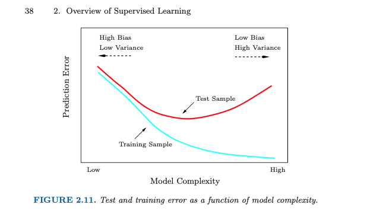
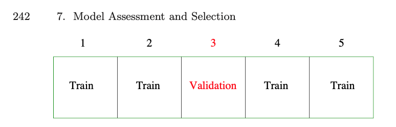
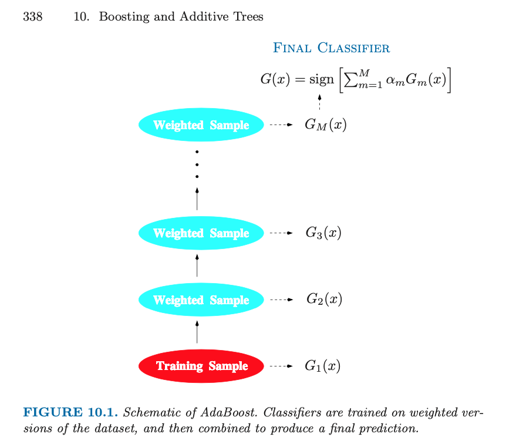
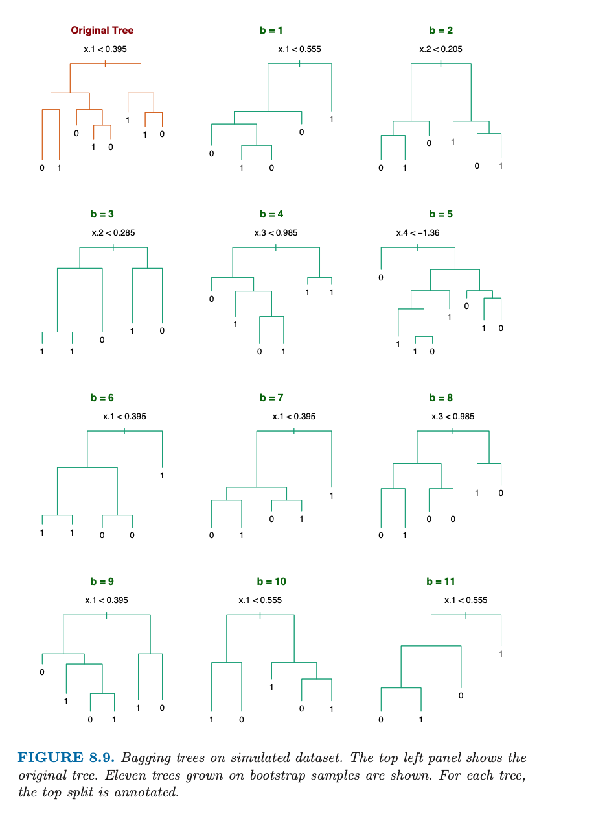
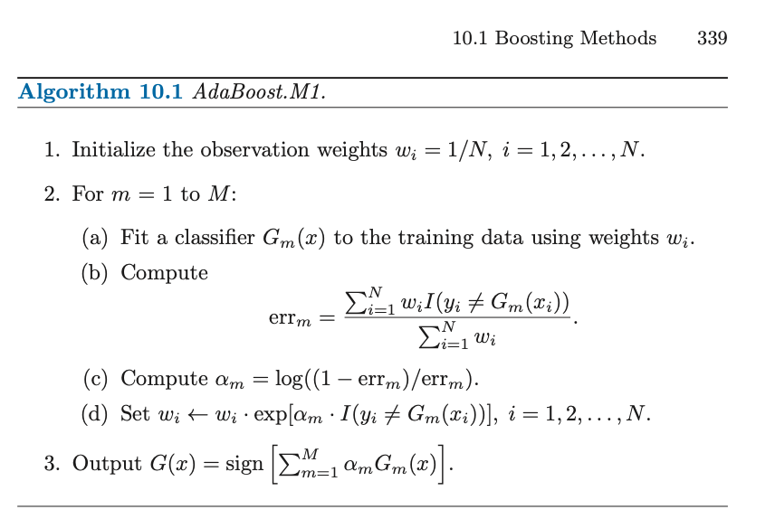
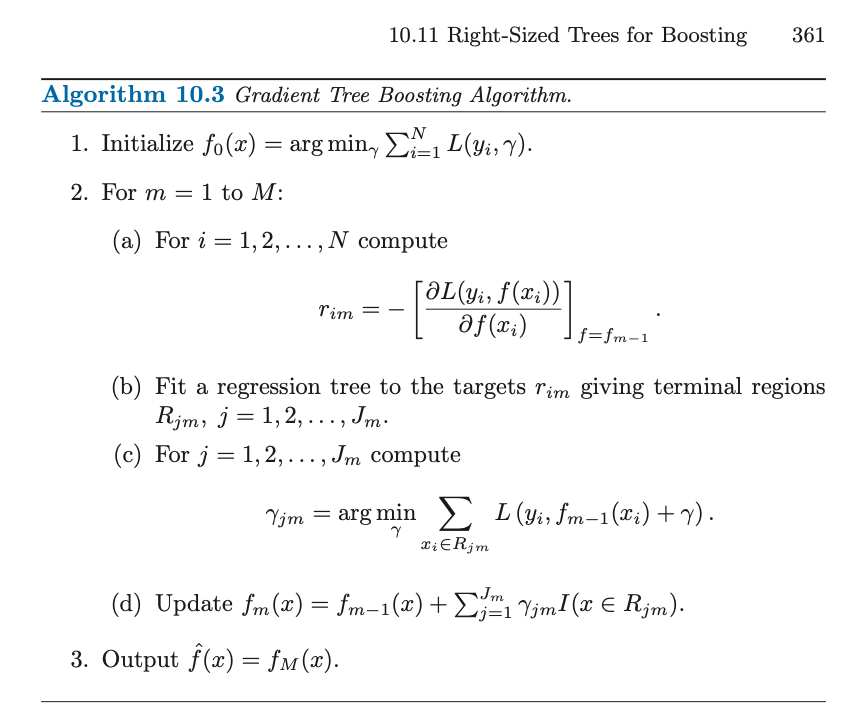
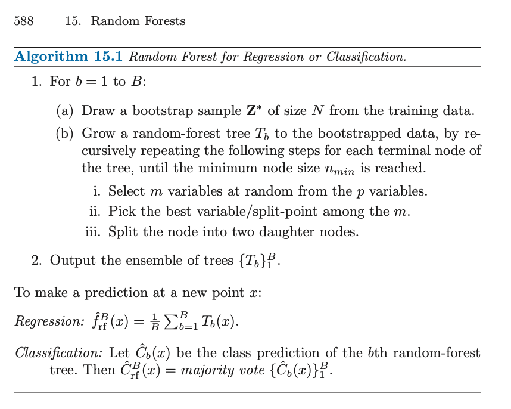

# Machine Learning in R

## About

*This workshop is being held online, registered participants should
have recieved a link to a BlueJeans meeting at their umich email address.*

Last given: [March 19, 2-4pm](https://ttc.iss.lsa.umich.edu/ttc/sessions/machine-learning-in-r/)

In this workshop, we’ll first discuss core machine learning concepts such as: choosing loss functions and evaluation metrics; splitting the data into training, validation, and testing sets; and cross-validation patterns for tuning hyper-parameters. Next, we’ll apply these concepts to train models for identifying isolated letters from speech (https://archive.ics.uci.edu/ml/datasets/isolet).

Specifically, we’ll apply the elastic net (a generalization of ridge and lasso regression), random forests, and gradient boosting to this task.  We’ll briefly discuss each model/method but our primary focus will be on understanding the core functionality of the related R packages (glmnet, randomForests, xgboost) and tuning associated hyper-parameters.

## Resources

[The Elements of Statistical Learning](https://web.stanford.edu/~hastie/ElemStatLearn/)
An excellent general resource and the source for all the images on this page. 

[Introduction to Machine Learning](https://m-clark.github.io/introduction-to-machine-learning/)
Michael Clark's ML notes.

## Examples

+ [Isolet data](https://archive.ics.uci.edu/ml/machine-learning-databases/isolet/)
+ [isolet_ex1-glmnet.R](./isolet_ex1-glmnet.R)
+ [isolet_ex2-xgboost.R](./isolet_ex2-xgboost.R)
+ [isolet_ex3-rf.R](./isolet_ex3-rf.R)

## Machine Learning Concepts

### Loss functions

The *loss* or *objective* function measures the discrepency between obersved and predicted 
values, sometimes also including a penalty on the model complexity. 

It's important that the loss chosen reflects the scale of the response variable being 
modelled. The most commonly used loss functions are:

+ Mean Squared Error for continuous responses / regression problems,
+ Logistic Loss or Binary Cross entropy for binary data,
+ multinomial or cross entropy for multi-category data.

### Training / Testing

- Training data: Used to learn model parameters,
- Validation data: Used to select hyperparameters for regularization or model class,
- Test data: Used to independently assess model performance on "new" data not used
in the model building process.

### Overfitting

Overfitting is the term used to describe the concept of training a model that does a better
job of predicting training examples than new cases not used in model training. Overfititng
can also be thought of as fitting a model with too much complexity -- hence, varaince -- than
is warranted given the data.



#### Cross validation

To prevent overfitting,	we generally use a validation data set or a cross validation 
process to tune hyperparameters controlling model complexity. In cross validation, we
split the training data into K-folds and iteratively put one fold in the role of the 
validation set while using the other K-1 folds to train the model. 

 

## The Isolet data

The [Isolet](https://archive.ics.uci.edu/ml/machine-learning-databases/isolet/)
dataset we will use for examples today consists of data from recordings of
individuals pronouncing each letter of the English alphabet. It is *tabular*
data meaning that features (variables) of interest have already been extracted.

Because each person vocalizes more than one letter, our data are not independent.
While not adjusting for this fact in our loss function, we will take this into
consideration when assigning cross-validation folds. We do this because predicting
spoken letters from a new individual is different from (possibly harder than)
predicting an unheard letter from an individual in our training data.

The testing and training split created by the data authors already accounts for
this. The data were collected in 5 waves, with the first 4 waves being training
data and the $5^{th}$ used for testing.  We will use the same distinction.

For validation, we will use 10-fold cross validation assigning all data for each
individual to the same fold. In this way, our validation evaluations will more closely
resemble our intended testing scheme. 

## Elastic Net

### Overview
The elastic net is a form of penalized regression for generalized linear models
and similar regression problems such as the Cox model. In addition to the usual
likelihood based loss or deviance, it penalizes the regression coefficients $\beta$
using:

```
$J(\beta; \alpha, \lambda) = \lambda \left( \frac{1 - \alpha}{2} ||\beta||^2_2 + \alpha||\beta||_1\right).$
```

For a continuous response variable with a Guassian likelihood, the standard regression
problem becomes:

```
$\hat \beta = \arg\min_{\beta} \frac{1}{2n}||Y-X\beta||^2 + J(\beta; \alpha, \lambda).$
```

### Key Functions and Arguments

In our first example, [isolet_ex1-glmnet.R](./isolet_ex1-glmnet.R), we will use
the R package `glmnet`.  

+ `glmnet()` -
  - `x` the model matrix (usually without intercept) 
  - `y` the response varaible
  - `family` the GLM family / likelihood to use
  - `alpha` the elastic net mixing parameter
  - `nlambda` how many lambdas to fit the model for
  - `standardize` if `TRUE`, internally rescales columns of `x` to have variance 1
  - `intercept` if `TRUE` and intercept is fit. 
  
+ `cv.glmnet()` -
  - `parallel` to use a parallel backend

## Gradient Boosting

### Overview

Boosting is a method for building an additive classifier or regression function from
a collection of simpler functions such as linear models or trees.  There are three
key ideas:

+ Simpler classifiers such as trees are combined sequentially;
+ At each step, samples are re-weighted to give more influence to high-residual or
misclassified samples;
+ The final model is a weighted sum of the models learned in each step. 

Below is a screenshot of Figure 10.1 from ESL depicting the boosting concept.


The "weak" classifiers used in boosting can be linear classifiers or trees, with
the latter being more common. Below is an image of a tree classifier taken from ESL.



Conceptually, I find it helpful to understand boosting using the original AdaBoost 
algorithm given in the screenshot from ESL below.



Gradient boosting is similar, except that rather than being the new classifier from each
stage to the pseudo-residuals it instead fits the new classifier to negative gradients
at each sample point. The algorithm, as given in ESL, appears below.



### Key Functions and Arguments

The boosting example we'll review, [isolet_ex2-glmnet.R](./isolet_ex2-xgboost.R), 
use the `xgboost` package which is an interface for the popular 
[XGBoost](https://xgboost.readthedocs.io/en/latest/) library. 

+ `xgb.DMatrix` - construct a training matrix in the format used by `xboost`

+ `xgb.train` - trains the gradient boosted classifier
  - `params` - a list of parameters controlling the model space and training
  - `data` - the data as created using `xgb.DMatrix`
  - `nrounds` - the maximum number of boosting rounds during training
  - `watchlist` - used to get feedback on validation data as training progresses

+ The `params` list has several important arguments. We'll focus on:
  - `booster` - trees or linear models,
  - `eta` - the learning rate, downscales the contribution of each new tree
  - `max_depth` - the maximum depth of the trees
  - `subsample` - subsampling at each step can help prevent overfitting
  - `objective` - the objective function to use for fitting
  - `eval_metric` - an evaluation metric to monitor on the validation data

+ `predict` - S3 method for prediction,
  - `ntreelimit` for prediction using the model from an earlier stage, to prevent overfitting.

## Random Forest

Our final example, [isolet_ex3-rf.R](./isolet_ex3-rf.R), will use the `randomForest` package.
It is also possible to build models akin to randomForests using the XGBoost library.

### Overview

Random forests are one of the easiest to use ML tools for tabular data and
often need very little tuning. In addition, the algorithm allows for an
"out-of-bag" estimate of the error rate that makes use of a validation
dataset or cross-validation scheme largely redundant.

Below is the random forest algorithm as described in ESL.


### Key Functions and Arguments

Our final example, [isolet_ex3-rf.R](./isolet_ex3-rf.R), will use the `randomForest` package.
It is also possible to build models akin to randomForests using	the XGBoost library.

+ `randomForest`
  - `x` - a matrix of predictor variables,
  - `y` - the reponse,
  - `ntree` - how many trees to include in the model,
  - `mtry` - how many variables to consider when splitting each node in a tree.

