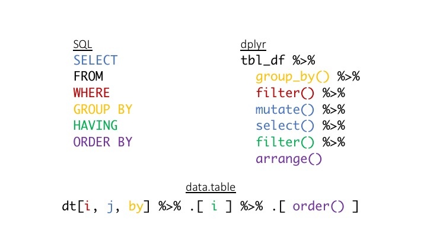

## Abstract

Matt Dowle, author of the data.table package, describes it as, “provid[ing] a high-performance version of base R's data.frame with syntax and feature enhancements for ease of use, convenience and programming speed.” In this workshop I will first introduce the data.table syntax using generic SQL and the dplyr R package as reference points.  Topics to be discussed include subsetting, aggregating, and merging data frames.  I will then discuss updating by reference and its role in efficiently working with large data sets.  Other advanced uses of the powerful data.table syntax will be covered as time permits.

## Getting Started

We will begin by introducing the fundamentals of the data.table syntax using dplyr and (generic) SQL as reference points.

You can access the examples presented by visiting: https://jbhender.github.io/data.table_intro.html . The source code
is available as [./data.table_intro.Rmd](./data.table_intro.R).

You can find an R script with executable code at [data.table_intro.R](./data.table_intro.R).

Solutions to exercises can be found at [exercise_solutions.R](./exercise_solutions.R).

## Additonal topics

Merging data.tables [example_merge.R](./example_merge.R).

Using the special symbol .SD for "subset of data" and the related parameter .SDcols for controlling columns in these subsets 
[example_SD.R](./example_SD.R). Also provides examples of `dcast` and `melt` for reshaping between wide and long.

[Benchmarks](https://h2oai.github.io/db-benchmark/) comparing speed between data.table, dplyr, and other database manipulation tools.

