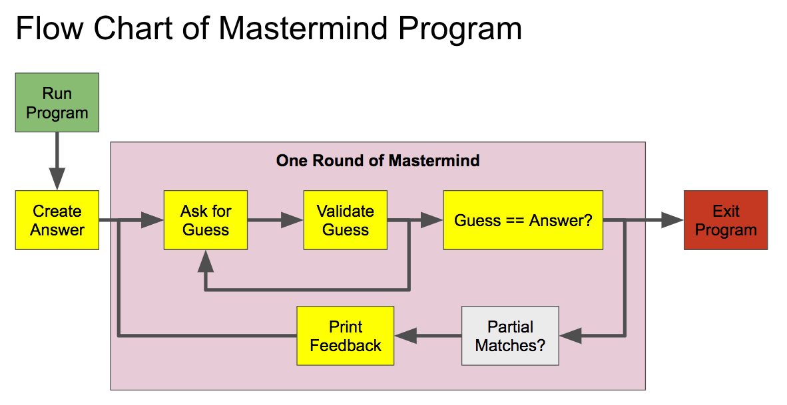

# R Short Course, Part 5 - Practicum

## Agenda

- [2-2:05] Welcome
- [2:05-2:15] Questions
- [2:15-3:30] Session 1
- [3:30-3:40] Break
- [3:40-4:50] Session 2
- [4:50-5:00] Wrap Up

## The Mastermind Project

To give you some  practical experience programming in R,
we will build a console version of the game
[mastermind](http://www.webgamesonline.com/mastermind/).

In doing so, you will make use of the
following programming concepts:  
  - types and classes
  - indexing
  - functions
  - Boolean relational operators
  - iteration using `for` and/or `while` loops
  - string manipulations.

The project is divided in a series of tasks below.
Each task builds on prior tasks to build up the game.

### Flow



### Task 0

Play a game of 
[mastermind](http://www.webgamesonline.com/mastermind/)
to familiarize yourself with the rules and gameplay.
How would you break the game into steps?

### Task 1 - Getting Started

1. Create and save an R script called `masteRmind.R`
2. Use comments `#` to create a header with a short
   description of the project goal, your name, and
   today's date.
3. First, we will create a "dictionary" of 8 color
   abbreviations to use for the game. In your script,
   create a named character vector `col_dict` with these 8
   color words as its values:
   Red, Green, Blue, Yellow, Gold, Orange, Black, and White.
   Set the `names()` attribute of `col_dict` to these abbreviations:
   R, Gr, Bu, Y, Go, O, Ba, W.
4. Use `stopifnot()` to add tests to your script to ensure
   that your dictionary has
   length 8, is of type "character", and
   that all colors and abbreviatons are unique.

[Solution](./masteRmind_task1.R)

### Task 2 - Create the secret code

5. Write a function `gen_code(n, dict)` that generates a secret code
   of length `n` from a dictionary of colors `dict` using the
   function `sample()`. Be sure to document your function's purpose,
   inputs, and outputs.

6. Add an argument `repeats` to `gen_code()` to allow control over
   whether the code is allowed to include repeated color words.
   Set the default of `repeats` to `FALSE`.

7. Use `stopifnot()` to write tests that your function returns an
   object of the right length and that all returned values are from
   the provided dictionary of color words.  Use `n = 4` and `col_dict`
   in your tests.

[Solution](./masteRmind_task2.R)

### Task 3 - Request User Input

8. Write a function `request_input(msg_input)` that prints a string
   'msg_input' prompting the player for input, waits to recieve that input,
   and then returns the input recieved. Use `cat()` to display the message and
   `readline()` to capture user
   input. Near the beginning of your script, create a list `msgs` to collect
   all messages for the game and include an entry `msg_input` in that list.
   

9. Modify your function `request_input()` and the default message from the previous step
   to also take an argument `num_guess` so that the user is prompted for
   guess 1, 2, 3, etc.  *Hint: Use `sprintf()`*.

10. Test that your function works. 

11. When we write instructions for the player, we'll ask them to input their
    guess as an unqouted sequence of colors or abbreviations separate by
    commas.  Write a function `split_guess()` to split the user input at
    each comma and then trim any whitespace. Use the base functions `strsplit()`
    and `stringr::str_trim()`. 

12. Insert the test below into your script:

```
guess = "Blue, Orange, Green, Red"
stopifnot(split_guess(guess) == c('Blue', 'Orange', 'Green', 'Red'))
```

[Solution](./masteRmind_task3.R)

### Task 4 -- Clean and validate user input

13.  We'd like to allow users to use the full color name or the abbreviations
     from `col_dict` as input.  To do that, let's write a function `clean_guess()`
     that takes the output of `split_guess()` above and replaces abberviations with
     the correpsonding color or NA if input isn't a color or an abbrevation. Use
     `stringr::str_to_lower()` and `stringr::string_to_title()` to automatically
     correct any capitalization errors. 

14. Insert the test below into your script to test `clean_guess()`

```
stopifnot(
  c('R', 'gr', 'blue', 'Brown') |> 
      clean_guess(dict = col_dict) %in% c('Red', 'Green', 'Blue', NA)
))
```

15. Next, write a function `validate_guess()` that prints
    helpful messages when the user inputs a guess incorrectly. For now,
    we will handle the following cases: the guess is too short, the
    guess is too long, or the guess has invalid colors. 

[Solution](./masteRmind_task4.R)

## Task 5 - Provide Feedback

16. Write a function `check_guess(g, secret, repeats = FALSE)` that
    accepts the (cleaned) user guess `g` and returns a list with
    the following two entries: `n_exact` giving the number of
    correct guesses (color in the right position) and `n_color`
    giving the number of correct colors (regardless of position).
    For the case without repeats in the secret, you can use the
    `intersect()` function to determine `n_color`.  The repeat case
    is more challenging and can be skipped for now.

17. Write a function `feedback()` that provides the user with
    feedback about the number of correct positions ('red pips')
    and the number of correct colors ('white pips').
    
    
[Solution](./masteRmind_task5.R)

## Task 6 - Put it all together

I'll finish this task while you're working today. 